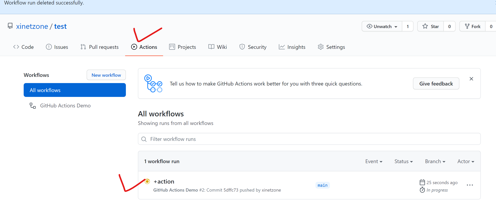

# 快速入门

本文将介绍如何从零开始创建 GitHub Action。

1. 创建一个 GitHub 仓库，比如：[xinetzone/test](https://github.com/xinetzone/test)。
2. 将 xinetzone/test 克隆到本地，并在 `.github/workflows` 目录中创建一个名为 `demo.yml` 的新文件。 
3. 将以下 YAML 内容复制到 `demo.yml` 文件中：

````{margin}
`name`
:   （可选）将出现在 GitHub 仓库的 Actions（操作）选项卡中的工作流程名称。 如果省略 `name`，GitHub 将其设置为相对于仓库根目录的工作流程文件路径。

`on`
:   指定自动触发工作流程文件的事件。此示例使用 `push` 事件，这样每次有人推送更改到仓库时，作业都会运行。您可以设置工作流程仅在特定分支、路径或标记上运行。有关包含或排除分支、路径或标记的语法示例，请参阅“[GitHub Actions 的工作流程语法](https://docs.github.com/actions/reference/workflow-syntax-for-github-actions#onpushpull_requestpaths)”。

`jobs`
:   将工作流程文件中运行的所有作业组合在一起。

`check-bats-version`
:   定义存储在 `jobs` 部分的作业的名称。

`runs-on`
:   配置作业在运行器上运行。这意味着该作业将在 GitHub 托管的新虚拟机上执行。

`steps`
:   将作业中运行的所有步骤组合在一起。此部分下嵌套的每项都是一个单独的操作或 shell 命令。

`- uses`
:   `uses` 关键字指示作业的操作。只要工作流程针对仓库的代码运行，或者您使用仓库中定义的操作，您都必须使用检出操作。（`- uses: actions/checkout@v2`）

`- run`
:   `run` 关键字指示作业在运行器上执行命令。
````

```yaml
name: GitHub Actions Demo
on: [push]
jobs:
  check-bats-version:
    runs-on: ubuntu-latest
    steps:
      - uses: actions/checkout@v2
      - uses: actions/setup-node@v1
      - run: npm install -g bats
      - run: bats -v
```

将修改后的内容提交、推送到 GitHub，便可看到：



更详细的介绍见 [Quickstart for GitHub Actions](https://docs.github.com/en/actions/quickstart)。

至此便是一个简单的 GitHub Action 创建过程。

[GitHub Marketplace](https://github.com/marketplace/actions/) 可以查找一些常用的操作。
